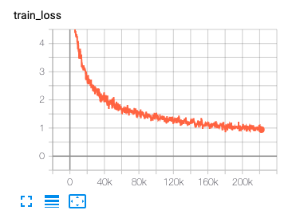
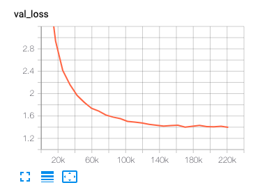

# transformer-pl

This repository is implementation of **[Transformer](https://papers.nips.cc/paper/7181-attention-is-all-you-need.pdf)** using :zap:**[Pytorch Lightning](https://github.com/PyTorchLightning/pytorch-lightning)**
to translate Korean to English

:zap: **PyTorch Lightning** is an open-source Python library that provides a high-level interface for PyTorch.  
It is my first time using **Pytorch Lightning** and I feel it is very flexible and easy to organize the code :smile:

## Requirements
```
pytorch-lightning>=0.9.0
sentencepiece==0.1.91
torchtext==0.7.0
torch>=1.5.0
```


## Dataset
For this project, I used 1,100,000 sentences from [AI HUB Korean-English AI Training Text Corpus](https://aihub.or.kr/aidata/87).

| DATASET | SENTENCES |
| :-----: | :-------: |
|  TRAIN  | 1,000,000 |
|  VALID  |   5,000   |
|  TEST   |   5,000   |

To use [torchtext](https://github.com/pytorch/text) and this repo, please check the `sample.tsv` in `./data` folder for data format.


## Training
To train, 

```
python main.py --epochs 30
```

If you use GPU,

```
python main.py --gpus 1 --epochs 30
```


#### Optional (Train tokenizer)

I uploaded my pretrained sentencepiece tokenizer files, but if you want to train tokenzier with your own corpus please run the code like below.

```python
import sentencepiece as spm

input_file = 'kor.txt'
vocab_size = 32000  # Choose your vocab size
model_name = 'kor'
model_type = 'bpe'
character_coverage = 0.9995

input_argument = '--input=%s --model_prefix=%s --vocab_size=%s --model_type=%s --character_coverage=%s --pad_id=0 --unk_id=1 --bos_id=2 --eos_id=3 '
cmd = input_argument%(input_file, model_name, vocab_size, model_type, character_coverage)
spm.SentencePieceTrainer.Train(cmd)
```

```python
import sentencepiece as spm

input_file = 'eng.txt'
vocab_size = 32000  # Choose your vocab size
model_name = 'eng'
model_type = 'bpe'
character_coverage = 1

input_argument = '--input=%s --model_prefix=%s --vocab_size=%s --model_type=%s --character_coverage=%s --pad_id=0 --unk_id=1 --bos_id=2 --eos_id=3 '
cmd = input_argument%(input_file, model_name, vocab_size, model_type, character_coverage)

spm.SentencePieceTrainer.Train(cmd)
```

## Result

If you use :zap: **PyTorch Lightning**, you can easily see the learning process with TensorBoard or other loggers.

```python
%load_ext tensorboard
%tensorboard --logdir lightning_logs/
```

### Train Loss Curve




### Valid Loss Curve




### Test Bleu Score

| BLEU  | BLEU1 | BLUE2 | BLEU3 | BLEU4 |
| ----- | :---: | :---: | :---: | :---: |
| 26.28 | 56.7  | 33.3  | 21.2  | 14.0  |

## Translate

To translate, set the checkpoint in `translate.py` file after you finish train and run this file.

```
python translate.py
```

Examples,

```
kor : 안녕! 내일 뭐해?
eng : Hi! What are you doing tomorrow?
```

```
kor : 어제 무슨 영화봤어?
eng : What movie did you watch yesterday?
```

```
kor : 인공지능 공부는 재밌어요!
eng : Artificial intelligence studies are fun!
```

## References
* [Torchtext Tutorial](https://simonjisu.github.io/nlp/2018/07/18/torchtext.html)
* [jadore801120/attention-is-all-you-need-pytorch](https://github.com/jadore801120/attention-is-all-you-need-pytorch)
* [Huffon/pytorch-transformer-kor-eng](https://github.com/Huffon/pytorch-transformer-kor-eng)
* [paul-hyun/transformer-evolution](https://github.com/paul-hyun/transformer-evolution/tree/master/transformer)
* [graykode/nlp-tutorial](https://github.com/graykode/nlp-tutorial/tree/master/5-1.Transformer)
